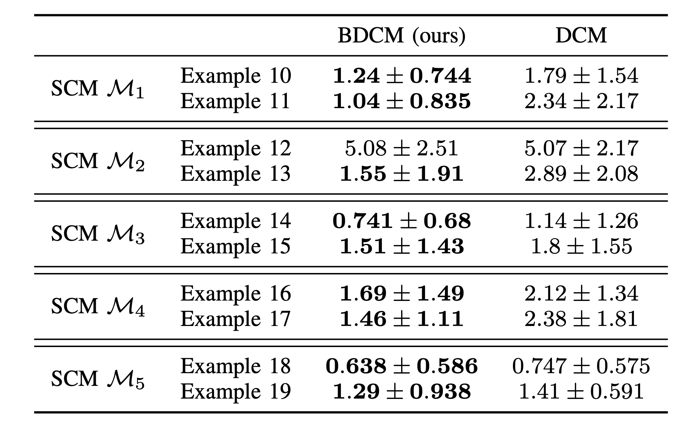
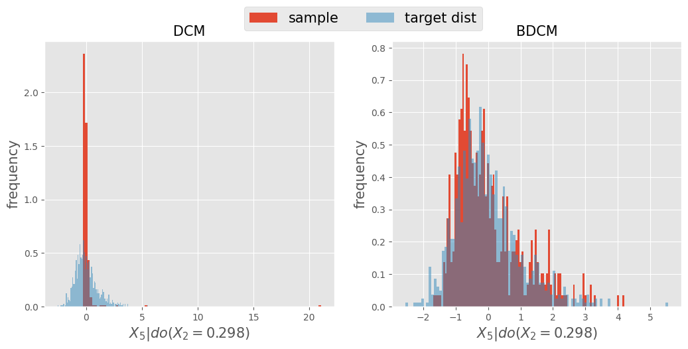
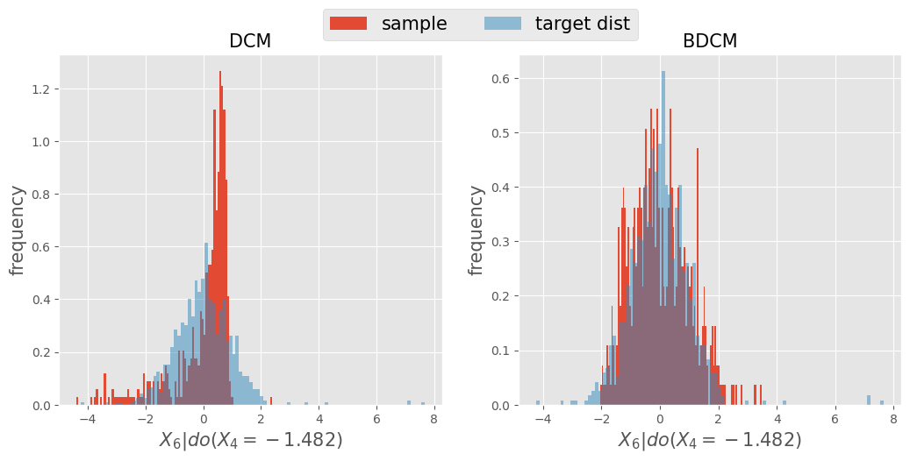
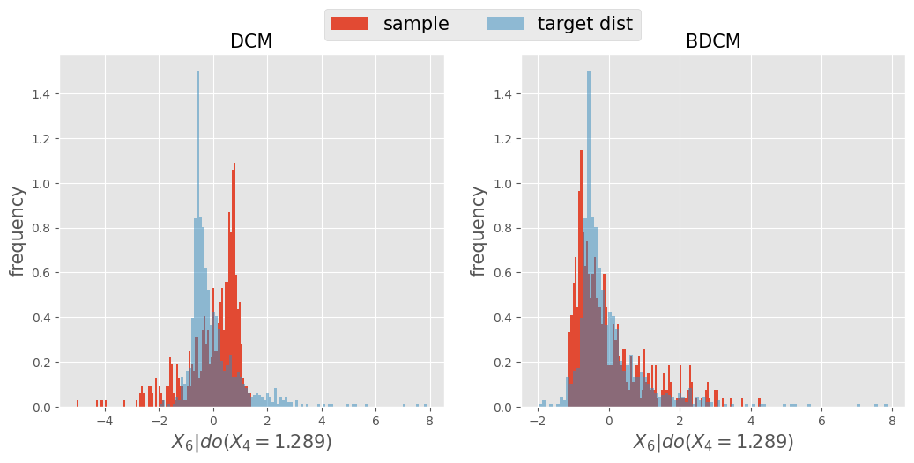
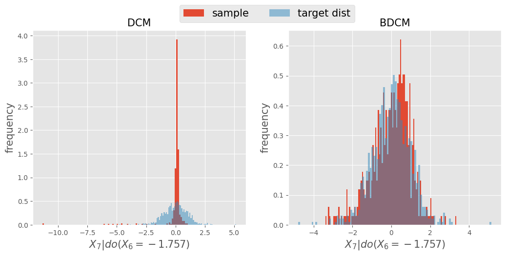
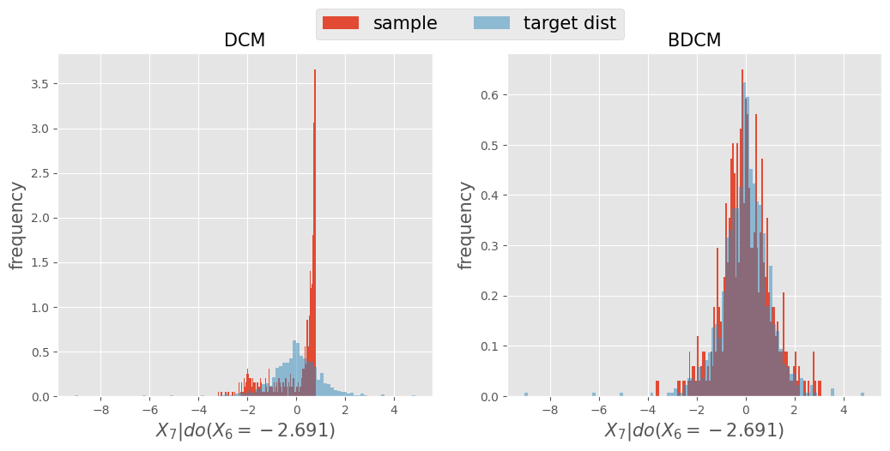
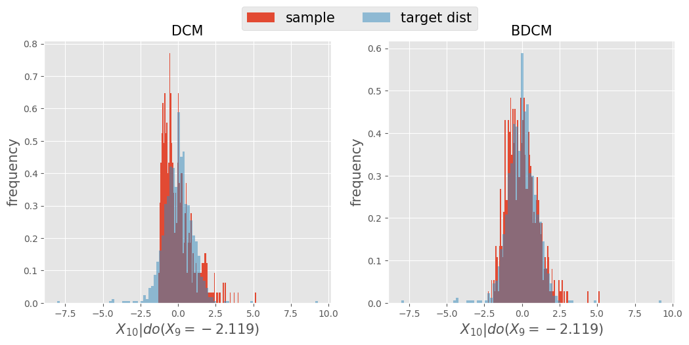
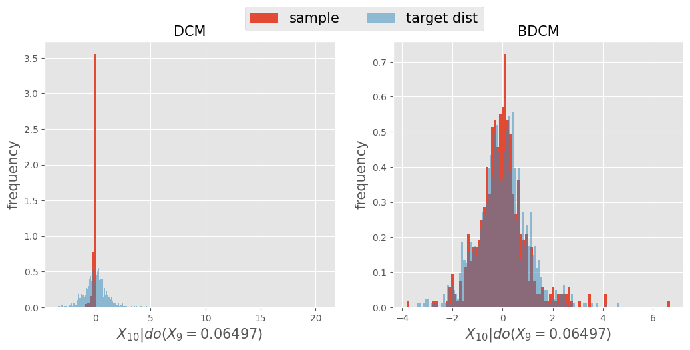
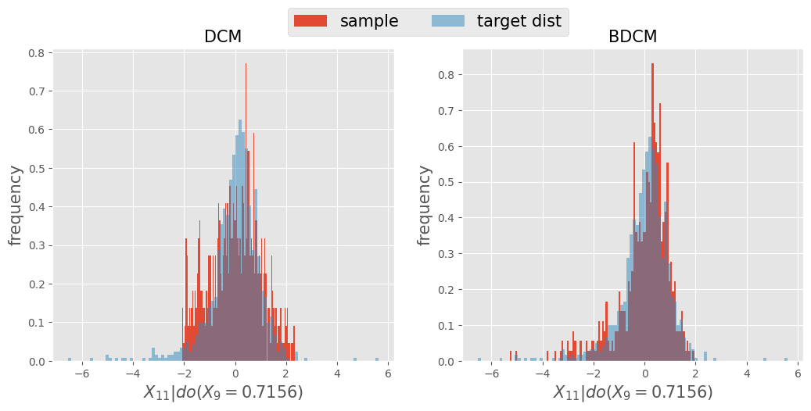
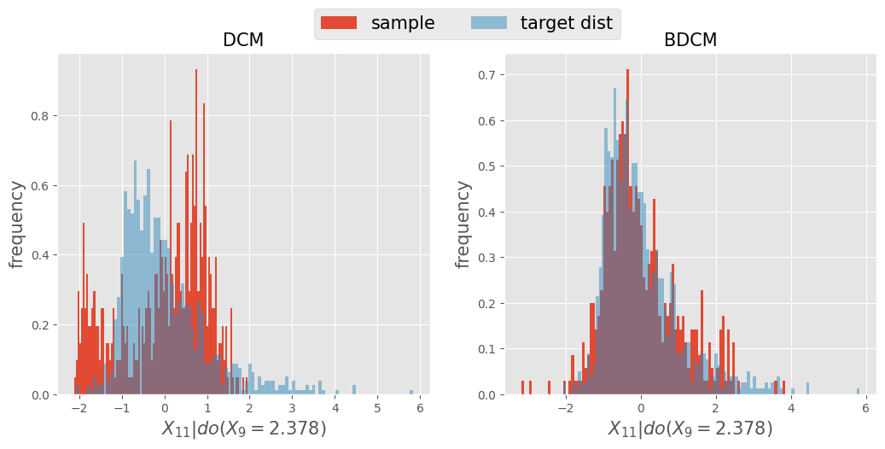

# Dissusion Model in Causal Inference with Unmeasured Confounders

This repository is for the exeriment conducted in ["Dissusion Model in Causal Inference with Unmeasured Confounders"](https://arxiv.org/abs/2308.03669) ([IEEE SSCI 2023](https://attend.ieee.org/ssci-2023/))" by [Tatsuhiro Shimizu](https://ss1.xrea.com/tshimizu.s203.xrea.com/works/index.html).

## Abstract

We study how to extend the use of the diffusion model to answer the causal question from the observational data under the existence of unmeasured confounders. In Pearl's framework of using a Directed Acyclic Graph (DAG) to capture the causal intervention, a [Diffusion-based Causal Model (DCM)](https://arxiv.org/abs/2302.00860) was proposed incorporating the diffusion model to answer the causal questions more accurately, assuming that all of the confounders are observed. However, unmeasured confounders in practice exist, which hinders DCM from being applicable. To alleviate this limitation of DCM, we propose an extended model called Backdoor Criterion based DCM (BDCM), whose idea is rooted in the Backdoor criterion to find the variables in DAG to be included in the decoding process of the diffusion model so that we can extend DCM to the case with unmeasured confounders. Synthetic data experiment demonstrates that our proposed model captures the counterfactual distribution more precisely than DCM under the unmeasured confounders.

## Citation

```
@article{shimizu2023diffusion,
  title={Diffusion Model in Causal Inference with Unmeasured Confounders},
  author={Shimizu, Tatsuhiro},
  journal={arXiv preprint arXiv:2308.03669},
  year={2023}
}
```


## Requirements and Setup
```bash
# clone the repository
git clone https://github.com/tatsu432/BDCM
```

The versions of Python and necessary packages are specified as follows.

```
[tool.poetry.dependencies]
python = ">=3.9,<3.10"
obp = "0.5.5"
scikit-learn = "1.0.2"
pandas = "1.3.5"
scipy = "1.7.3"
numpy = "^1.22.4"
matplotlib = "^3.5.2"
seaborn = "^0.11.2"
hydra-core = "1.0.7"
```


### Section 4: Synthetic Data Experiment
```
# How does BDCM perform in comparison with DCM under the existence of unmeasured confounders?
```
<div align="center">
  
</div>

#### SCM 1
<div align="center">

</div>

```
# Exapmle 10 (SCM 1 and simple structural equations)
SCM1_simple.ipynb
```
<div align="center">

</div>

```
# Exapmle 11 (SCM 1 and complex structural equations)
SCM1_complex.ipynb
```
<div align="center">

</div>

#### SCM 2

<div align="center">

</div>

```
# Exapmle 12 (SCM 2 and simple structural equations)
SCM2_simple.ipynb
```
<div align="center">

</div>

```
# Exapmle 13 (SCM 2 and complex structural equations)
SCM2_complex.ipynb
```
<div align="center">

</div>

#### SCM 3
<div align="center">

</div>


```
# Exapmle 14 (SCM 3 and simple structural equations)
SCM3_simple.ipynb
```
<div align="center">

</div>

```
# Exapmle 15 (SCM 3 and complex structural equations)
SCM3_complex.ipynb
```
<div align="center">

</div>

#### SCM 4
<div align="center">

</div>

```
# Exapmle 16 (SCM 4 and simple structural equations)
SCM4_simple.ipynb
```
<div align="center">

</div>

```
# Exapmle 17 (SCM 4 and complex structural equations)
SCM4_complex.ipynb
```
<div align="center">

</div>

#### SCM 5
<div align="center">

</div>

```
# Exapmle 18 (SCM 5 and simple structural equations)
SCM5_simple.ipynb
```
<div align="center">

</div>

```
# Exapmle 19 (SCM 5 and complex structural equations)
SCM5_complex.ipynb
```
<div align="center">

</div>
